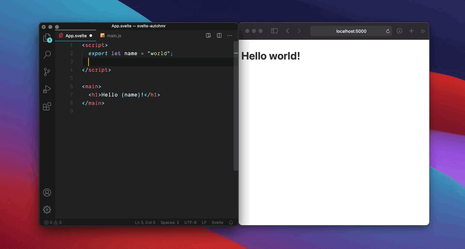

# svelte-preprocess-autoimport

> A preprocessor for automatic imports & createEventDispatcher.

Automatically adds import lines for `onMount`, etc.

Also automatically writes `const dispatch = createEventDispatcher()` for you.

The preprocessor puts the import statements in the blank spaces of your source files, so sourcemaps are unaffected.



## Example

Write:

```svelte
<script>
  onMount(() => {
    // ...
  })
</script>

<button on:click={() => dispatch('event')} />
```

Get:

```svelte
<script>
  import { onMount, createEventDispatcher } from 'svelte';

  const dispatch = createEventDispatcher();

  onMount(() => {
    // ...
  })
</script>

<button on:click={() => dispatch('event')} />
```

The transformed code that is actually produced is formatted like this to avoid breaking sourcemaps:

```svelte
<script>import { onMount, createEventDispatcher } from 'svelte'; const dispatch = createEventDispatcher();
  onMount(() => {
    // ...
  })
</script>

<button on:click={() => dispatch('event')} />
```

## User beware: Magic globals considered harmful

While less typing is obviously convenient, as it is often the case in programming, one needs to also consider the trade off we're making. Adding magic to a codebase often backfires more or less ~~spectacularly~~ annoyingly, experience teaches us.

Here's one seasoned developer comments about this project:

> I hate magic globals. It makes onboarding a nightmare.
> They’re bad enough in tests where they are broadly known. Framework specific ones are even worse. It also adds a bunch of limitations in how you name stuff. This one of the reasons svelte opts for explicit over implicit. It aids comprehension. Optimising for writability over readability and comprehension is a mistake imo.
>
> -- @pngwn, Discord 2020-09-23

This is actually an opinion that I embrace wholeheartedly, which probably seems a bit conflicted given I've made a tool to do exactly what is decried here...

To be clear, I'm not sure using this is a good idea in the long run. Really not sure, that is I'm not sure it's a bad idea either.

I've got a feeling we may be on a special case here. Imports from the root `svelte` package (`onMount`, `onDestroy`, `createEventDispatcher`...) are deeply ingrained in the framework. You can't use Svelte and not have them. They almost feel more like keywords of the Svelte DSL than normal imports.

In my views, Svelte is all about striking the right balance between dogmatism and pragmatism, in a quest for efficiency and simplicity. I feel that these "magic imports", if they are limited to the framework's own exports, might (or might not) get us closer to this balance. Maybe this balance is not the same for everyone and every projects...

And, for sure, micromanaging imports of `onMount` and such, that are ubiquitous in a codebase and can come and go during a component's development cycle can become a bit tedious. That's why I'm inclined, in this one case, to experiment with allowing a bit of magic to percolate into my codebase. To see if the gain is as much as I hoped. To see if I face some major drawbacks. In a nutshell, to experiment.

I think that's how you should take it too, if you decide to use this at this point. And, also, don't overlook pondering the above considerations.

That being said, let's go to play!

## Install

```bash
yarn add -D svelte-preprocess-autoimport
```

## Usage

In your Svelte config (example is for Rollup, but preprocessors are portable so it should work anywhere Svelte):

```js
import autoimport from 'svelte-preprocess-autoimport'
import svelte from 'rollup-plugin-svelte-hot'

...

export default {
  ...
  plugins: [
    svelte({
      ...
      preprocess: [
        autoimport()
      ]
    })
  ]
}
```

## Config

```js
autoimport({
  aliases: {
    // short form
    //
    // produces: import { onMount } from 'svelte'
    onMount: 'svelte',
    // produces: import { onDestroy } from 'svelte'
    onDestroy: 'svelte',

    // long form
    //
    // produces: import { onMount as useEffect } from 'svelte'
    useEffect: {
      import: 'onMount',
      from: 'svelte',
    },
  },

  // if the value (e.g. `$$dispatch`) is found in the code, then
  // createEventDispatcher will be imported an a dispatch variable with this
  // name will be created.
  //
  // NOTE: leading $ prefixes will be transformed to _ in the processed code
  //
  createEventDispatcher: '$$dispatch', // default: 'dispatch'
})
```

The [default config](https://github.com/rixo/svelte-preprocess-autoimport/blob/master/src/index.js#L3) is to automatize all imports from `svelte` and `svelte/*`.

You can pass a function to customize the default config:

```js
// e.g. a more conservative config that only aliases imports from `svelte` and
// createEventDispatcher automation
autoimport(defaults => ({
  ...defaults,
  aliases: {
    ...Object.fromEntries(
      Object.entries(defaults.aliases).filter(
        ([imp, from]) => from === 'svelte'
      )
    ),
  },
}))
```
